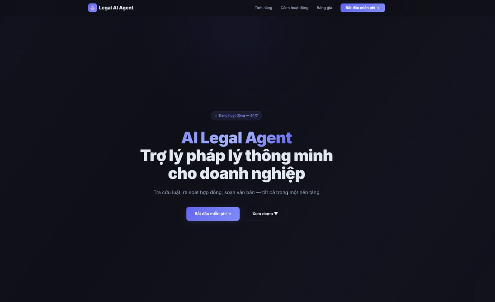
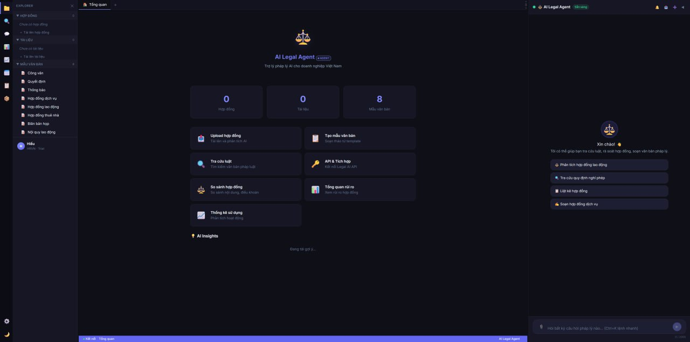
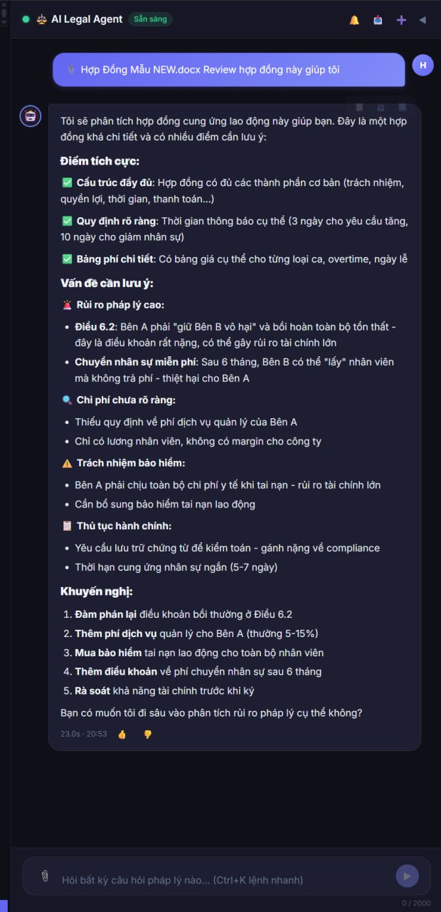
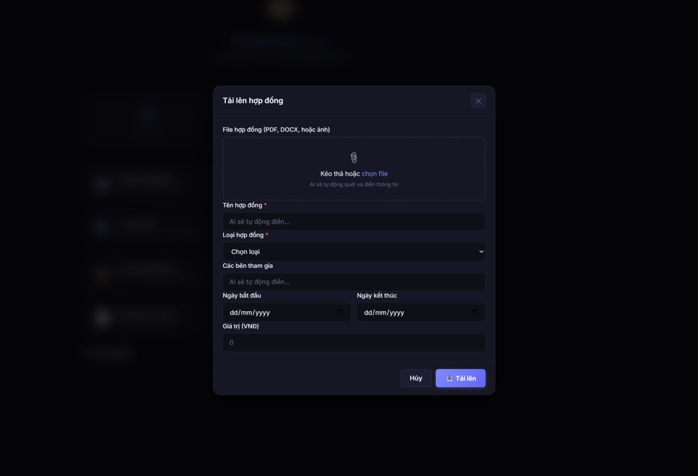

# ⚖️ AI Legal Agent

<p align="center">
  <a href="https://github.com/Paparusi/legal-ai-agent/stargazers"></a>
  <a href="https://github.com/Paparusi/legal-ai-agent/blob/main/LICENSE"></a>
  <a href="https://github.com/Paparusi/legal-ai-agent/actions/workflows/ci.yml"></a>
  <a href="https://www.python.org/downloads/"></a>
</p>

🇻🇳 [Tiếng Việt](README_VI.md) | 🇺🇸 English

> **Created by [Lê Minh Hiếu](https://github.com/Paparusi)** — Trader turned Builder 🇻🇳

**AI-powered legal assistant for Vietnamese businesses**

An AI platform for legal research, contract review, and legal document drafting — all in a VSCode-style interface.


---

## 📸 Screenshots

<p align="center">
  
  <br><em>Landing Page — Hero, features, pricing</em>
</p>

<p align="center">
  
  <br><em>Dashboard — VSCode-style 3-panel layout</em>
</p>

<p align="center">
  
  <br><em>AI Contract Review — Risk analysis, highlights, recommendations</em>
</p>

<p align="center">
  
  <br><em>Contract Upload — Drag & drop, AI auto-analysis</em>
</p>

## ✨ Features

### 🤖 AI Agent (24 Tools)
- **Legal search** — Search across 40,000+ Vietnamese legal documents
- **Contract review** — Risk analysis, missing clauses, amendment suggestions
- **Compliance check** — Verify labor/commercial/service contracts against Vietnamese law
- **Clause drafting** — Generate confidentiality, penalty, termination, force majeure clauses...
- **Contract summary** — Quick summary of parties, value, duration
- **Contract comparison** — Side-by-side diff of 2 contracts
- **Company memory** — Remembers company context across chat sessions
- **📂 Full document control** — Read, write, edit, delete, organize documents autonomously

### 🦾 Agentic AI — Full Document Control

**The AI is now "Cursor for lawyers" — full autonomous document manipulation capabilities.**

Legal AI can autonomously manage your documents and contracts:

#### What it can do:
- 📂 **Browse and search** — List all documents, search by folder/keyword/type
- 📖 **Read any document** — View full content, extract specific sections
- ✏️ **Edit specific clauses** — Find & replace text, track all changes
- 📝 **Generate new documents** — Draft contracts, memos, reports from scratch using AI
- 🔍 **Compare documents** — Side-by-side diff with similarity score
- 📋 **Review contracts for risks** — Batch review multiple files at once
- 🗂️ **Organize with folders** — Create folders, move files, tag documents
- 📊 **Batch operations** — Review 10+ contracts simultaneously
- 📜 **Track edit history** — Full audit trail of who changed what and when
- 🗑️ **Soft delete** — Delete documents with 30-day recovery window

#### Example Commands:
```
"Liệt kê tất cả hợp đồng"
"Đọc hợp đồng thuê mặt bằng số 123"
"Sửa điều khoản phạt trong HĐ này cho đúng luật"
"Soạn NDA giữa công ty A và B, thời hạn 2 năm"
"So sánh bản cũ và bản mới của HĐ lao động"
"Review tất cả 5 hợp đồng trong thư mục Dự án X"
"Tạo thư mục 'Khách hàng ABC' và di chuyển 3 hợp đồng vào đó"
"Xem lịch sử chỉnh sửa của tài liệu này"
```

#### Multi-Step Autonomous Workflows:
The AI can chain multiple tools together to complete complex tasks:

```
User: "Sửa điều khoản phạt trong HĐ ABC cho đúng luật"
AI: 
  1. read_document → Gets current content
  2. search_law → Finds relevant penalty law (8% max per Commercial Law)
  3. edit_document → Replaces old penalty clause with compliant version
  4. document_history → Shows what changed
```

```
User: "Soạn NDA giữa công ty A và B, lưu vào thư mục Khách hàng A"
AI:
  1. generate_document → Creates NDA from requirements
  2. create_folder → Creates "Khách hàng A" folder (if doesn't exist)
  3. write_document → Saves NDA to folder
```

#### New Agentic Tools (11):
1. `list_documents` — List all documents/contracts with search & filter
2. `read_document` — Read full content or specific sections
3. `write_document` — Create new documents with metadata & tags
4. `edit_document` — Find & replace text, track changes
5. `compare_documents` — Diff two documents (summary/detailed/clause-by-clause)
6. `create_folder` — Create organizational folders for cases/projects
7. `move_document` — Move documents between folders
8. `delete_document` — Soft delete (recoverable for 30 days)
9. `generate_document` — AI drafts legal documents from requirements
10. `batch_review` — Review multiple documents for risks simultaneously
11. `document_history` — View full edit history and audit trail

## 📋 Contract Review AI

Upload contracts for instant AI-powered review:

- ⚠️ **Risk identification and scoring** — 10 risk categories analyzed
- ⚖️ **Vietnamese law compliance check** — Civil Code, Commercial Law, Labor Law
- 💡 **Revision suggestions** — Specific amendments with legal references
- 📊 **Clause-by-clause analysis** — Risk levels: LOW / MEDIUM / HIGH / CRITICAL
- 📄 **8+ contract templates** — Ready-to-use Vietnamese templates

### Risk Categories Analyzed

1. **Điều khoản bất lợi** — One-sided clauses favoring one party
2. **Phạt vi phạm cao** — Excessive penalty clauses (>8% per Vietnamese law)
3. **Thời hạn bất hợp lý** — Unreasonable deadlines/terms
4. **Thiếu điều khoản bảo vệ** — Missing protective clauses
5. **Mâu thuẫn với luật** — Clauses contradicting Vietnamese law
6. **Điều khoản tự động gia hạn** — Auto-renewal traps
7. **Giới hạn trách nhiệm** — Liability limitations
8. **Bảo mật và SHTT** — IP/confidentiality issues
9. **Giải quyết tranh chấp** — Dispute resolution (arbitration vs court)
10. **Force majeure** — Missing or weak force majeure

### Supported Contract Types
- Employment (Hợp đồng lao động)
- Lease (Hợp đồng thuê mặt bằng)
- Sale (Hợp đồng mua bán)
- Service (Hợp đồng dịch vụ)
- NDA / Confidentiality (Bảo mật thông tin)
- Loan (Hợp đồng vay)
- Agency (Hợp đồng đại lý)
- Business Cooperation (Hợp đồng hợp tác kinh doanh)

### API Usage

**Review a contract:**
```bash
POST /v1/contracts/{contract_id}/review-ai
```

**Get review results:**
```bash
GET /v1/contracts/{contract_id}/review-ai
```

**Response structure:**
```json
{
  "review_id": "review_20250319_143000",
  "contract_title": "Hợp đồng thuê mặt bằng",
  "contract_type": "lease",
  "parties": ["Công ty A", "Công ty B"],
  "risk_score": 72,
  "risk_level": "HIGH",
  "summary": "Hợp đồng có 5 điều khoản rủi ro cao...",
  "clauses": [
    {
      "clause_number": "Điều 5",
      "title": "Phạt vi phạm",
      "content": "Bên B phải trả phạt 20%...",
      "risk_level": "CRITICAL",
      "risk_score": 95,
      "issue": "Mức phạt 20% vượt quá quy định",
      "law_reference": "Điều 301 Luật TM 2005: phạt ≤ 8%",
      "suggestion": "Giảm mức phạt xuống ≤ 8%"
    }
  ],
  "missing_clauses": [
    {
      "clause": "Force Majeure",
      "importance": "HIGH",
      "suggestion": "Thêm Điều 156 BLDS 2015"
    }
  ],
  "compliance": {
    "civil_code": {"status": "PARTIAL", "issues": 2},
    "commercial_law": {"status": "VIOLATION", "issues": 1},
    "labor_law": {"status": "N/A"}
  },
  "recommendations": [
    {
      "priority": 1,
      "action": "Sửa Điều 5: giảm phạt 20% → 8%",
      "reason": "Vi phạm Điều 301 Luật TM 2005"
    }
  ]
}
```

### 📊 Dashboard & Analytics
- Risk Dashboard — Overview of risks across all contracts
- Contract Calendar — Monthly contract schedule
- Usage Analytics — Usage stats, top queries
- Audit Log — Activity journal

### 🎯 Enterprise Features
- Batch upload (10 files at a time)
- Report export (.docx)
- Contract versioning & notes
- Smart suggestions (AI-powered contract improvements)
- Bulk analysis (analyze 20 contracts simultaneously)
- Universal search (contracts + docs + laws + chats)
- Template auto-fill
- Onboarding wizard

### 🏗️ Platform Administration

Self-hosted deployments include a full **Platform Super Admin** panel for system administration:

#### Access
Navigate to `/platform-admin` (requires superadmin role)

#### Features
- **📊 Dashboard** — Real-time platform statistics, usage trends, top companies
- **🏢 Multi-tenant Management** — Manage all companies, change plans, set quotas, activate/deactivate
- **👥 User Management** — View all users across tenants, change roles, manage permissions
- **⚙️ System Settings** — Configure LLM provider, file limits, registration settings, feature flags
- **💰 LLM Usage & Cost Tracking** — Token usage by provider/company, estimated monthly costs
- **📋 Audit Logs** — Full platform-level action logging with user attribution
- **🔧 Maintenance Tools** — DB statistics, cleanup scripts, reindex operations

The Platform Admin panel provides complete control over your self-hosted Legal AI deployment:

```bash
# Navigate to platform admin
https://your-domain.com/platform-admin

# Available stats:
- Total companies, users, documents, contracts
- Vietnamese law database size (60K+ documents, 117K+ chunks)
- Daily/monthly query volumes
- Active users, storage usage
- Usage trends (30-day charts)
- Revenue estimates by plan

# Management capabilities:
- Create/edit/deactivate companies
- Change subscription plans (trial → starter → pro → enterprise)
- Adjust quota limits per company
- Reset user passwords, change roles
- View company-specific usage history
- Configure system-wide settings
- Track LLM costs per company
- Full audit trail of admin actions
```

### 📱 Modern UI
- VSCode-style 3-panel layout
- Dark/Light theme
- Mobile responsive (bottom tab bar)
- PWA installable
- SSE streaming chat
- Command palette (Ctrl+K)
- Keyboard shortcuts

### 🕷️ Data Crawler (Powered by CrawlKit)
Legal AI Agent can automatically crawl Vietnamese legal websites to build and update your document database.

#### Supported Sources
- 📚 **Thư Viện Pháp Luật** (thuvienphapluat.vn) — Largest Vietnamese legal document database
- 🏛️ **Văn Bản Pháp Luật Chính Phủ** (vbpl.vn) — Official government legal portal
- 📰 **Công Báo** (congbao.chinhphu.vn) — Official Gazette of Vietnam
- 🌐 **Any legal website URL** — Custom legal document sources

#### Setup
1. Get your free API key at [crawlkit.org](https://crawlkit.org)
2. Add to `.env`:
   ```
   CRAWLKIT_API_KEY=your_api_key_here
   ```
3. Start crawling!

#### Usage

**Via API:**
```bash
POST /crawler/crawl
{
  "url": "https://thuvienphapluat.vn/van-ban/..."
}
```

**Via AI Chat:**
```
"Crawl văn bản tại https://thuvienphapluat.vn/van-ban/123"
```

**Other endpoints:**
- `GET /crawler/sources` — List supported legal sources
- `POST /crawler/discover` — Discover legal document links from a page
- `POST /crawler/batch` — Batch crawl multiple URLs
- `GET /crawler/status` — Check CrawlKit configuration

#### Pricing
- **Free:** 100 requests/day *(perfect for getting started)*
- **Starter:** $19/mo — 10,000 requests
- **Pro:** $79/mo — 100,000 requests

[Get your free CrawlKit API key →](https://crawlkit.org)

---

## 🚀 Quick Start

### Prerequisites
- Python 3.10+
- PostgreSQL (or Supabase)
- Claude API key ([console.anthropic.com](https://console.anthropic.com))

### 1. Clone & Install

```bash
git clone https://github.com/Paparusi/legal-ai-agent.git
cd legal-ai-agent
pip install -r requirements.txt
```

### 2. Configure

```bash
cp .env.example .env
# Edit .env with your credentials
```

### 3. Database Setup

```bash
# Run migrations
python scripts/run_migration.py

# Load Vietnamese law data (optional, ~40K documents)
python scripts/load_law_data.py
python scripts/index_chunks.py
```

### 4. Run

```bash
uvicorn src.api.main:app --host 0.0.0.0 --port 8080
```

Open http://localhost:8080/static/app.html

### 🐳 Docker (Recommended)

```bash
# 1. Clone
git clone https://github.com/Paparusi/legal-ai-agent.git
cd legal-ai-agent

# 2. Configure
cp .env.example .env
nano .env  # Add your ANTHROPIC_API_KEY

# 3. Start (PostgreSQL + App)
docker compose up -d

# 4. Open
# http://localhost:8080/static/app.html
```

This starts PostgreSQL 15 (with pgvector) and the FastAPI app automatically.

**⚠️ Note:** The database schema is created automatically on first startup, but **law documents are empty by default**. To populate the legal database:

```bash
# Option 1: Crawl Vietnamese legal websites (recommended)
docker compose exec app python scripts/crawl_thuvien.py

# Option 2: Load from backup (if you have one)
docker compose exec app python scripts/load_law_data.py
```

Without legal data, the AI can still review/draft contracts, but legal search won't work.

#### 🖥️ Self-hosted (NAS / Xpenology / Synology)

Works on any Docker-capable device — NAS, Raspberry Pi, VPS, or local server.

```bash
# SSH into your NAS/server
git clone https://github.com/Paparusi/legal-ai-agent.git
cd legal-ai-agent
cp .env.example .env

# Edit .env — only ANTHROPIC_API_KEY is required
nano .env

# Start
docker compose up -d

# Access from any device on your network:
# http://NAS_IP:8080/static/app.html
```

**System requirements:**
- Docker + Docker Compose
- 512MB RAM minimum (1GB recommended)
- 1GB disk space
- Any CPU (x86_64 or ARM64)

**Ports:** `8080` (web UI), `5432` (PostgreSQL, optional external access)

**Persistent data:** PostgreSQL data is stored in a Docker volume (`pgdata`). Your data survives container restarts and updates.

**Update to latest version:**
```bash
git pull
docker compose build
docker compose up -d
```

## 📁 Project Structure

```
├── src/
│   ├── api/
│   │   ├── main.py              # FastAPI app + all routes
│   │   ├── routes/              # Route modules
│   │   │   ├── auth.py          # Login, register, API keys
│   │   │   ├── contracts.py     # Contract CRUD
│   │   │   ├── documents.py     # Document upload
│   │   │   ├── chats.py         # Chat history
│   │   │   ├── company.py       # Company management
│   │   │   └── admin.py         # Admin dashboard
│   │   └── middleware/
│   │       ├── auth.py          # API key verification
│   │       └── logging.py       # Usage logging
│   └── agents/
│       ├── legal_agent.py       # AI agent with 11 tools
│       └── company_memory.py    # Company context memory
├── static/
│   ├── app.html                 # Main SPA (~5600 lines)
│   ├── index.html               # Landing page
│   ├── admin.html               # Admin dashboard
│   └── manifest.json            # PWA manifest
├── scripts/
│   ├── load_law_data.py         # Import law documents
│   ├── index_chunks.py          # Chunk & index for search
│   └── run_migration.py         # DB migrations
├── docker-compose.yml           # One-command deploy
├── Dockerfile                   # Container build
├── .env.example                 # Environment template
├── requirements.txt
└── Procfile                     # Railway/Heroku deploy
```

## 🔧 API Endpoints

### Auth
| Method | Endpoint | Description |
|--------|----------|-------------|
| POST | `/v1/auth/register` | Register |
| POST | `/v1/auth/login` | Login |
| POST | `/v1/auth/api-key` | Generate API key |

### AI Chat
| Method | Endpoint | Description |
|--------|----------|-------------|
| POST | `/v1/legal/ask` | Ask AI agent |
| POST | `/v1/legal/ask-stream` | Ask AI (SSE streaming) |

### Contracts
| Method | Endpoint | Description |
|--------|----------|-------------|
| GET | `/v1/contracts` | List contracts |
| POST | `/v1/contracts/upload` | Upload contract |
| POST | `/v1/contracts/batch-upload` | Batch upload contracts |
| POST | `/v1/contracts/{id}/review` | AI contract review |
| POST | `/v1/contracts/{id}/report` | Export Word report |
| POST | `/v1/contracts/{id}/diff` | Compare 2 contracts |
| GET | `/v1/contracts/{id}/suggestions` | AI suggestions |
| POST | `/v1/contracts/bulk-analyze` | Bulk analysis |
| GET | `/v1/contracts/calendar` | Contract calendar |
| GET | `/v1/contracts/risk-overview` | Risk overview |

### Search
| Method | Endpoint | Description |
|--------|----------|-------------|
| GET | `/v1/legal/search` | Search laws |
| GET | `/v1/search/all` | Search everything |

### Analytics
| Method | Endpoint | Description |
|--------|----------|-------------|
| GET | `/v1/analytics` | Usage statistics |
| GET | `/v1/audit-log` | Activity log |
| GET | `/v1/insights` | AI insights |

## 🤖 Multi-LLM Provider Support

**Bring Your Own LLM** — Connect your preferred AI provider with **API Key** or **OAuth**:

### Supported Providers

| Provider | Models | Auth Methods | Context |
|----------|--------|--------------|---------|
| 🔵 **Anthropic Claude** | Sonnet 4, Opus 4, Haiku 3.5 | API Key | 200K tokens |
| 🟢 **OpenAI GPT** | GPT-4o, GPT-4o Mini, O1 | API Key, OAuth | 128-200K tokens |
| 🔴 **Google Gemini** | Gemini 2.5 Pro/Flash, 2.0 Flash | API Key, OAuth | 1M tokens |
| ⚫ **Custom/Local** | Ollama, vLLM, LM Studio | API Key | Variable |

### Configuration

1. **Via Dashboard:** Settings → AI Provider → Choose provider → Enter API key
2. **Via API:** `POST /v1/llm/configure` with your API key
3. **OAuth (OpenAI/Gemini):** Click "Connect with [Provider]" → Authorize → Done

### API Endpoints

| Method | Endpoint | Description |
|--------|----------|-------------|
| GET | `/v1/llm/providers` | List all providers + models |
| POST | `/v1/llm/configure` | Set API key (manual) |
| POST | `/v1/llm/test` | Test current connection |
| GET | `/v1/llm/status` | Current provider status |
| GET | `/v1/llm/models` | List models |
| POST | `/v1/llm/model` | Set model |
| GET | `/v1/llm/oauth/{provider}/authorize` | Start OAuth flow |
| GET | `/v1/llm/oauth/callback` | OAuth callback |
| POST | `/v1/llm/oauth/{provider}/refresh` | Refresh OAuth token |

### Features

- ✅ **Unified Interface:** Agent works with any LLM — no code changes
- 🔒 **Encrypted Storage:** API keys encrypted with Fernet (AES-256)
- 🔄 **OAuth Support:** Automated token management for OpenAI & Google
- 🛠️ **Tool Normalization:** Function calling formats normalized across providers
- 💾 **Company-Level Config:** Each company can use different LLM
- 🔁 **Fallback:** Defaults to `ANTHROPIC_API_KEY` env var if not configured

### Environment Variables

```bash
# Encryption key for API keys (generate with: python -c "from cryptography.fernet import Fernet; print(Fernet.generate_key().decode())")
LLM_ENCRYPTION_KEY=your-32-byte-key

# OAuth credentials (optional, for OAuth flow)
OPENAI_CLIENT_ID=your-openai-client-id
OPENAI_CLIENT_SECRET=your-openai-client-secret
GEMINI_CLIENT_ID=your-google-client-id
GEMINI_CLIENT_SECRET=your-google-client-secret
OAUTH_REDIRECT_URI=http://localhost:8080/v1/llm/oauth/callback

# Default fallback (if no provider configured)
ANTHROPIC_API_KEY=your-anthropic-key
```

## 💰 Pricing

| Tier | USD | VND | Queries/day | Contracts | Key Features |
|------|-----|-----|-------------|-----------|--------------|
| **Free** | $0 | 0₫ | 10 | 1 | Basic search, 2 templates |
| **Starter** | $29/mo | 725K₫ | 100 | 20 | AI review, all templates |
| **Professional** | $99/mo | 2.5M₫ | 500 | Unlimited | API, custom LLM, analytics |
| **Enterprise** | $499/mo | 12.5M₫ | Unlimited | Unlimited | SLA 99.9%, dedicated support |

**Discounts:** Annual -20% · Startups -30% · NGOs -50%

```bash
GET /v1/pricing  # Get pricing tiers
```

## 📄 Contract Templates

8 ready-to-use Vietnamese contract templates:

| Template | Law Reference |
|----------|--------------|
| Hợp đồng lao động | BLLĐ 2019 |
| Hợp đồng thuê mặt bằng | BLDS 2015 |
| Hợp đồng mua bán | Luật TM 2005 |
| Hợp đồng dịch vụ | BLDS 2015 |
| Hợp tác kinh doanh (BCC) | Luật ĐT 2020 |
| NDA / Bảo mật | Luật SHTT 2005 |
| Hợp đồng vay | BLDS 2015 |
| Hợp đồng đại lý | Luật TM 2005 |

All templates include `{{fillable_fields}}`, legal notes, and specific law article references.

```bash
GET /v1/templates              # List all templates
GET /v1/templates/{id}         # Get template content
POST /v1/templates/generate    # AI-fill template
```

## 🌐 Multi-Language (i18n)

Support Vietnamese and English:

```bash
# Vietnamese (default)
curl -H "Accept-Language: vi" /v1/pricing

# English
curl -H "Accept-Language: en" /v1/pricing
```

## 🛠️ Tech Stack

- **Backend:** FastAPI + Python
- **AI:** Multi-LLM (Claude, GPT, Gemini, Custom) via unified provider interface
- **Database:** PostgreSQL (Supabase) with pgvector
- **Search:** Full-text search + synonym expansion + TF-IDF ranking
- **Frontend:** Vanilla JS SPA (single HTML file)
- **Deploy:** Railway / Docker / Render (backend) + optional Cloudflare Pages (frontend)

## ☁️ Cloudflare Pages (Frontend) + API Backend

If you deploy frontend on Cloudflare Pages and backend on a different domain, use the split-deploy guide:

- [docs/CLOUDFLARE_PAGES_DEPLOY.md](docs/CLOUDFLARE_PAGES_DEPLOY.md)

Quick example:

```text
https://your-pages-domain/static/app.html?api_base=https://your-api-domain
```

## 🔄 Safe Upstream Sync (Keep Custom Domain/Data)

If you maintain a custom deployment and still want upstream updates safely:

- [docs/SAFE_SYNC_CUSTOM_DEPLOY.md](docs/SAFE_SYNC_CUSTOM_DEPLOY.md)

Post-sync smoke QA script:

- [scripts/qa_post_sync.ps1](scripts/qa_post_sync.ps1)

## 🆓 Recommended Free Stack

For the current architecture, the best free setup and operational checklist:

- [docs/FREE_TIER_RECOMMENDED_STACK.md](docs/FREE_TIER_RECOMMENDED_STACK.md)

## 📝 Vietnamese Law Database

The search engine indexes Vietnamese legal documents including:
- Labor Code 2019 (Bộ luật Lao động)
- Civil Code 2015 (Bộ luật Dân sự)
- Enterprise Law 2020 (Luật Doanh nghiệp)
- Commercial Law 2005 (Luật Thương mại)
- Corporate Income Tax, Personal Income Tax, VAT Laws
- And 40,000+ more...

## 🤝 Contributing

See [CONTRIBUTING.md](CONTRIBUTING.md) for guidelines. Areas that need help:
- [ ] More Vietnamese legal document sources
- [ ] Better NLP for Vietnamese text
- [ ] Test coverage
- [ ] Multi-language support

## 📄 License

MIT — free to use, including commercially.

## ⚠️ Disclaimer

This is an assistive tool and **does not replace** professional legal advice. Always consult a qualified lawyer for important legal decisions.

---

## 💖 Sponsors

Love this project? **[Become a sponsor!](https://github.com/sponsors/Paparusi)** 🙏

Your support helps maintain and expand this **open-source Vietnamese legal AI** platform. By sponsoring, you're supporting:

- 🇻🇳 **Vietnamese open-source** development
- ⚖️ **Democratized legal tech** for small businesses
- 📚 **Free legal AI tools** for everyone
- 🚀 **New features** and improvements

### 💰 Sponsor Tiers

| Tier | Monthly | Benefits |
|------|---------|----------|
| ☕ **Coffee** | $5 | Your name in sponsors list |
| 🥉 **Bronze** | $25 | Logo in README + priority issue response (24h) |
| 🥈 **Silver** | $100 | Direct support channel + feature request priority |
| 🥇 **Gold** | $500 | Prominent logo + custom features + quarterly calls |
| 🏢 **Enterprise** | Custom | SLA, white-label, custom development, private hosting |

**[👉 View all tiers & sponsor now](https://github.com/sponsors/Paparusi)**

_For Enterprise inquiries: [GitHub Issues](https://github.com/Paparusi/legal-ai-agent/issues) or [@gau_trader on Telegram](https://t.me/gau_trader)_

### 🌟 Current Sponsors

_No sponsors yet — **be the first!** Your logo could be here. 🚀_

See [.github/SPONSORS.md](.github/SPONSORS.md) for full details.

---

Made with ❤️ by [Lê Minh Hiếu](https://github.com/Paparusi) 🇻🇳
